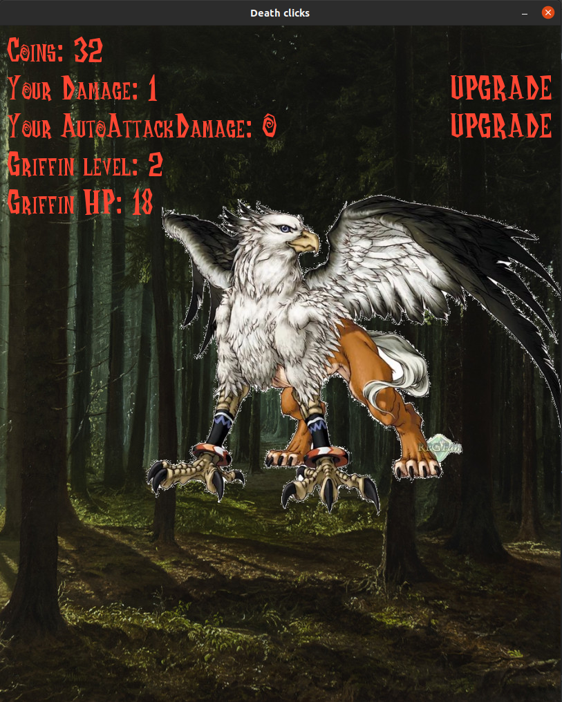

# Запуск игры
Для запуска программы надо прописать одну команду в консоли, запущенной в файле с игрой:
```bash
cd <Путь к директорию, где будет лежать игра>
git clone https://github.com/OvOlzhas/PythonReview1.git
cd PythonReview1
python3 main.py
```

Также для запуска игры понадобиться установить **pygame**.

# Инструкция по игре Death Clicks
Вы доблестный герой, который уничтожает всех врагов на своем пути.
Сейчас вы находитесь в лесу. Вам придется выжить убивая всех врагов и прокачивая свои 
навыки. Удачи!

Слева сверху Вы можете увидеть:
 - **Coins**: Ваши монеты, полученные через удары по врагам. Их можно тратить
   на прокачку своего урона за клик и *Авто-атаки*.
 - **Your Damage**: Ваш урон, который Вы наносите ударами по врагу. Каждый нанесенный 
урон дает Вам монеты.
 - **Your AutoAttackDamage**: Ваш урон от *Авто-атаки*. *Авто-атака* воспроизводится каждую
   секунду и дает Вам монеты в зависимости от урона. *Монеты = Авто-атака / 3* (Деление целочисленное)
 - **Enemy level**: Уровень врага. Чем больше уровень, тем больше жизней у врага.
 - **Enemy HP**: Количество очков жизни врага. Если **Enemy HP** упадет до нуля, враг умрет.

Справа сверху в зависимости от количества монет могут появляться надписи "UPGRADE". 
Если появится около **Your Damage**, то это означает что у Вас появилась возможность
прокачать свою атаку. С **Your AutoAttackDamage** аналогично.  
Нажмите на надпись, чтобы
прокачать соответствующий характеристику Вашего персонажа.



Ах, да... Враги могут двигаться :sunglasses:
